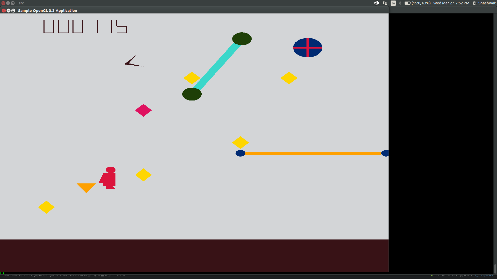
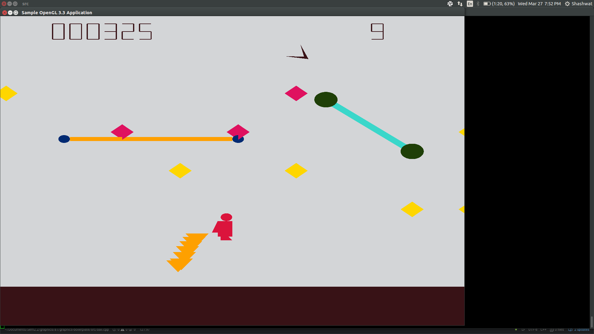
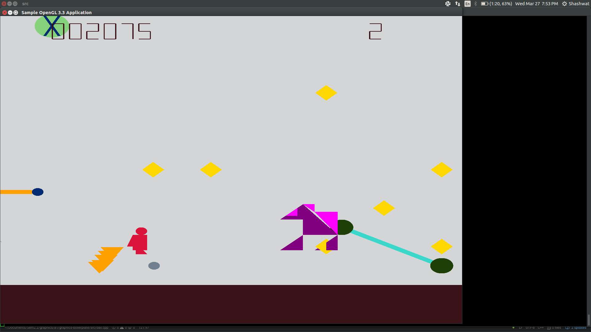

# Jetpack-Game

## Description:
This is a simulation of the popular Jetpack Joyride game, built using C++ library, OpenGL. The game consists of most features the original game consists of, such as, player moving up, down, right and left, fire enemies, powerups,with some added enemies like Viserion, magnets and boomerangs. The score is displayed at the top left of the screen and the number of lives left at the top right.

## Controls:
- **Moving up**
    - Spacebar 
    - Up Arrow 
    - W key
- **Moving down** 
    - Down Arrow 
    - S key
- **Moving right** 
    - Right Arrow 
    - D key
- **Moving left** 
    - Left Arrow 
    - A key
- **Shoot water balloons** 
    - X key

## Running the code:
* Create a directory outside the *src* directory, say *build*
* Change directory to build and run 
    ```bash
        cmake ..
    ```
* Then run inside the build directory, 
    ```bash
        make
    ```
* Run the game using 
    ```bash
        ./graphics_asgn1
    ```
 ## Screenshots from the game
 



    
